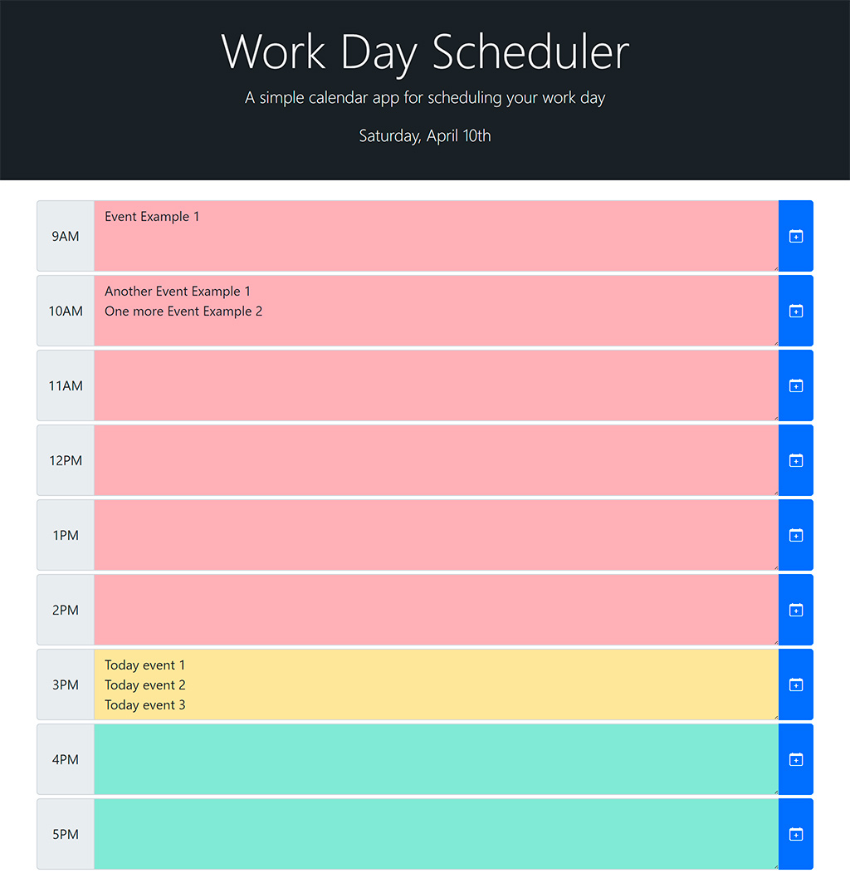

# Day Scheduler

**Author: _Oleksandr Kulyk_**

**Preview link** - https://alexkuwerz.github.io/unh-day-scheduler/

## Description

Simple calendar application that allows a user to save events for each hour of the day. Data is saved in Local Storage. Each timeblock is color coded to indicate whether it is in the past (red), present (yellow), or future (green). This app will run in the browser and feature dynamically updated HTML and CSS powered by jQuery.

## Technologies

HTML, CSS, JavaScript.

## Third Party Libraries

[jQuery](https://jquery.com/), [Bootstrap v5.0](https://getbootstrap.com/docs/5.0/getting-started/introduction/), [Day.js](https://day.js.org/)

## Preview Images

* **App View**

